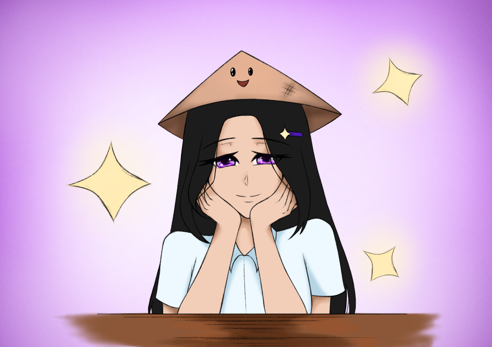

# Hiraya Storybook

## Project Overview
Welcome to the Hiraya Storybook project. This is a private repository for CSC11 Group 2's Integrated Output.

## Description
Hiraya Storybook is a culmination of our efforts in the CSC11 course. This project showcases our skills in software development, graphic design, and creative writing. 

## Team
Our project team consists of dedicated individuals who have contributed their unique skills to the development of Hiraya Storybook.

**Developers:**
- Euclid Jan Guillermo
- Kenneth Lacaba

**Graphic Designers:**
- Abigail Sallegue
- Edward Aquino

**Story Writers:**
- Laurence Flores
- Raunak Chandra Shrestha
- Paolo Macuja
- Julienne Serafin

We hope you enjoy exploring our project as much as we enjoyed creating it.